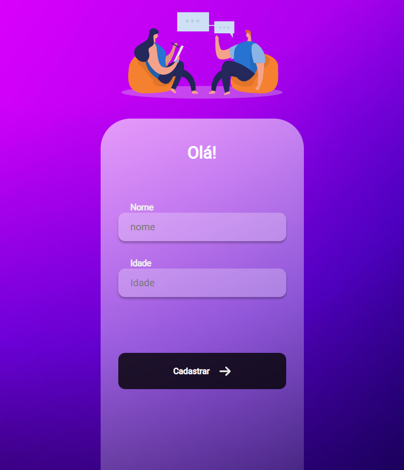
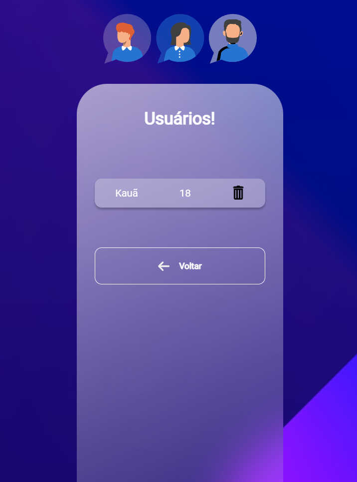

<h1 align="center"> Cadastro de Usuários </h1>

 Projeto criado durante os módulos de React e Nodejs do <a target="_blank" href="https://rodolfomori.com.br/devclub/">DevClub</a>  .

<h3 align="center"> <b>Página principal de cadastro</b></h3>
 

<h3 align="center"> <b>Página dos usuários cadastrados</b></h3>

## 🚀 Tecnologias

Esse projeto foi desenvolvido com as seguintes tecnologias:

- HTML e CSS
- JavaScript
- React 
- Nodejs
- API Rest 

## 🌎<i>Onde me encontrar:</i>  

  
   
  
 

